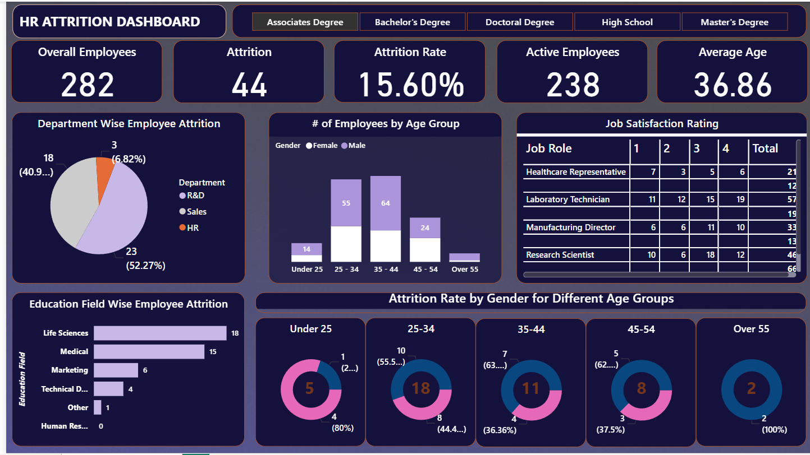

# HR-ATTRITION
HR Attrition Dashboard
## 📊 Power BI Dashboard

An interactive Power BI dashboard that analyzes employee attrition by department, age group, gender, education field and job role, with a job satisfaction breakdown.

Project Overview

This project is a Power BI dashboard built to understand employee attrition in an HR dataset. It shows headline HR KPIs at the top and breaks attrition down by department, age group, gender and education field. A job satisfaction matrix compares ratings across job roles.

An education-level slicer lets users switch between Associates Degree, Bachelor's Degree, Doctoral Degree, High School and Master's Degree. The figures in this README come from the Associates Degree view shown in the screenshot.

Business Objective

Help HR stakeholders see how many employees have left, which groups are most affected, and how satisfied employees are in different job roles.

Problem Statement

Attrition numbers in a spreadsheet show how many people left, but not where or among whom. This dashboard breaks the total down by department, age, gender and education field so patterns are easier to spot.

Dataset / Data Source
Dataset name: Not specified
Source: Not specified
Rows / columns: Not specified
Fields visible in the dashboard:
Department (R&D, Sales, HR)
Age and Age Group (Under 25, 25-34, 35-44, 45-54, Over 55)
Gender
Education level (Associates Degree, Bachelor's Degree, Doctoral Degree, High School, Master's Degree)
Education Field (Life Sciences, Medical, Marketing, Technical Degree, Other, Human Resources)
Job Role
Job Satisfaction rating (1 to 4)
Attrition and Active Employee status
Context: Employee-level HR data
Key Features / Analysis
KPI cards: Overall Employees, Attrition, Attrition Rate, Active Employees, Average Age
Department-wise attrition analysis
Employee distribution by age group and gender
Education field-wise attrition analysis
Attrition split by gender across age groups
Job satisfaction matrix by job role (ratings 1 to 4)
Education-level slicer to filter the whole dashboard
Key Insights / Results

These figures come from the Associates Degree view in the screenshot.

KPI	Value
Overall Employees	282
Attrition	44
Attrition Rate	15.60%
Active Employees	238
Average Age	36.86
R&D and Sales account for most attrition. R&D has 23 exits (52.27%) and Sales has 18 (about 40.9%), together 41 of the 44. HR has 3 (6.82%).
The 25-34 age group has the highest attrition. It has 18 exits, followed by 11 in the 35-44 group. Together these two groups make up 29 of the 44 exits.
Life Sciences and Medical backgrounds lead by education field. Life Sciences has 18 exits and Medical has 15, together 33 of 44. Marketing has 6, Technical Degree 4, Other 1 and Human Resources 0.
The workforce is concentrated in the 25-44 age range. The 25-34 and 35-44 groups are the largest by headcount.
Job satisfaction varies by role. Among the roles visible in the table, Laboratory Technician has the largest total (57), with 19 employees rating 4 and 11 rating 1. The table scrolls, so not all roles are visible in the screenshot.
Methodology / Workflow

Raw HR Data (source not specified) ↓ Data Loading into Power BI ↓ Measures for Employees, Attrition, Attrition Rate, Active Employees, Average Age ↓ Dashboard Design (KPI cards, charts, matrix, slicer) ↓ Interactive Filtering by Education Level ↓ Attrition and Satisfaction Insights

Data cleaning and transformation steps are not specified.

Dashboard / Application
Layout: A title bar with an education-level slicer, five KPI cards, and a grid of charts below.
KPIs: Overall Employees, Attrition, Attrition Rate, Active Employees, Average Age
Visualizations:
Pie chart: Department Wise Employee Attrition
Stacked column chart: Number of Employees by Age Group, split by gender
Matrix: Job Satisfaction Rating by Job Role (ratings 1 to 4 with totals)
Bar chart: Education Field Wise Employee Attrition
Donut charts: Attrition Rate by Gender for Different Age Groups (Under 25, 25-34, 35-44, 45-54, Over 55)
Filters: Education level (Associates Degree, Bachelor's Degree, Doctoral Degree, High School, Master's Degree)
Interactivity: Selecting an education level updates the KPIs and charts.

See the Screenshots section.

Tools & Technologies
Business Intelligence
Power BI

Other tools are not specified.

Skills Demonstrated
Business Intelligence and Dashboard Development
KPI Design
Data Visualization
HR Analytics
Attrition Analysis
Interactive Filtering
Data Storytelling
Project Structure
hr-attrition-dashboard/
│
├── README.md
└── screenshots/
    └── Screenshot_2026-09-30_121948.png

Add the Power BI file and dataset here once they are in the repository. Their names are not specified.

How to Run / Use
Clone the repository.
Open the Power BI file (.pbix) in Power BI Desktop. File name: Not specified.
Use the education-level buttons at the top to filter the dashboard.
Review the KPI cards and charts as they update.
Results / Business Value

The dashboard lets users:

See overall headcount, attrition, attrition rate and average age at a glance
Identify which departments, age groups and education fields have the most attrition
Compare job satisfaction ratings across job roles
Compare education-level segments using the slicer

No revenue, cost or efficiency improvements are claimed.

Future Improvements
Add a legend to the gender donut charts so each color is labeled
Show the full job satisfaction table without scrolling
Add attrition analysis by tenure, salary or job role
Add an all-education-levels summary view
Add automated data refresh
Add predictive modeling for attrition risk
Screenshots

Show Image

Author

Name: Vikas Naik Role: [Data Analyst / Power BI Developer] Skills: Power BI, Data Visualization, KPI Reporting LinkedIn: [LINK] GitHub: [LINK]
